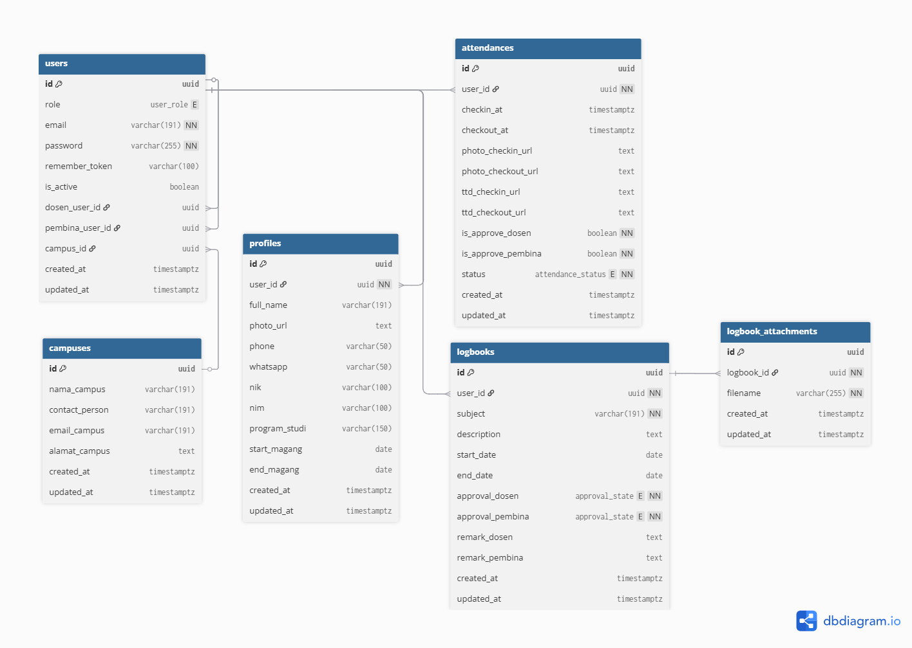

# InternTrack

<p align="center">
  
</p>

<p align="center">
  <strong>Sistem Manajemen Magang Terpadu</strong><br>
  Dibangun dengan Laravel 10 & PostgreSQL
</p>

---

## 📋 Tentang Project

**InternTrack** adalah sistem berbasis web untuk mempermudah institusi dan perusahaan dalam memantau aktivitas peserta magang secara terpadu. Aplikasi ini mendukung multi-peran pengguna (admin perusahaan, dosen pembimbing, pembina, dan mahasiswa) serta menyediakan fitur presensi, logbook harian, lampiran berkas, dan proses persetujuan berlapis.

### 🔥 Status Terbaru

* **Dashboard inti siap**: ringkasan mahasiswa magang, status presensi, dan logbook terkini.
* **Fitur presensi harian**: check-in & check-out dengan foto dan tanda tangan digital.
* **Logbook aktivitas**: mendukung lampiran berkas dan persetujuan oleh dosen & pembina.
* **Manajemen multi-institusi**: dukungan relasi ke entitas kampus untuk pelaporan lintas institusi.

### ✨ Fitur Utama

* 🔐 Autentikasi & manajemen sesi.
* 👥 Role-based access control: company\_admin, dosen, pembina, mahasiswa.
* 📑 Profil pengguna (NIM/NIK, program studi, periode magang, kontak, foto).
* 🕒 Presensi harian: check-in, check-out, status hadir/izin/sakit/alpa, bukti foto & tanda tangan, approval dosen & pembina.
* 📘 Logbook aktivitas: subjek, deskripsi, periode kegiatan, persetujuan & catatan revisi, lampiran berkas.
* 🏫 Relasi ke Kampus (campuses) untuk mendukung pengelolaan lintas institusi.

### 🛠️ Teknologi yang Digunakan

* **Backend:** Laravel 10 (PHP ^8.1)
* **Database:** PostgreSQL / MySQL / MariaDB
* **Templating:** Blade
* **ORM:** Eloquent

---

## 🚀 Instalasi

Ikuti langkah-langkah berikut untuk menjalankan project ini di local environment:

### 📋 Prasyarat

Pastikan sudah menginstal:

* PHP >= 8.1
* Composer
* Database server (PostgreSQL/MySQL/MariaDB)
* Git

### 1️⃣ Clone Repository

```bash
git clone <repo-url>
cd InternTrack
```

### 2️⃣ Install Dependencies

```bash
composer install
```

### 3️⃣ Setup Environment

```bash
# Copy file environment
cp .env.example .env

# Generate application key
php artisan key:generate
```

### 4️⃣ Konfigurasi Database

Edit file `.env` sesuai konfigurasi database Anda:

```env
DB_CONNECTION=pgsql
DB_HOST=127.0.0.1
DB_PORT=5432
DB_DATABASE=interntrack
DB_USERNAME=your_username
DB_PASSWORD=your_password
```

### 5️⃣ Buat Database

Login ke database lalu buat database baru:

```sql
CREATE DATABASE interntrack;
```

### 6️⃣ Migrasi Database

```bash
php artisan migrate
```

### 7️⃣ Setup Storage Link

```bash
php artisan storage:link
```

### 8️⃣ Jalankan Aplikasi

```bash
php artisan serve
```

Aplikasi akan berjalan di `http://localhost:8000`.

---

## 📚 Dokumentasi

### Struktur Database

* `users` – Data akun & relasi role
* `profiles` – Biodata pengguna (NIM, NIK, dsb)
* `campuses` – Data institusi asal
* `attendances` – Presensi harian
* `logbooks` – Catatan kegiatan magang
* `logbook_attachments` – Lampiran berkas logbook

### ERD



[Download ERD](./InternTrack.png)

Atau impor file `database/schema.dbml` ke [dbdiagram.io](https://dbdiagram.io/) untuk melihat versi interaktif.

---

## 🤝 Kontribusi

Kontribusi sangat terbuka. Langkah umum:

1. Fork repository ini.
2. Buat branch baru: `git checkout -b feature/NamaFitur`
3. Commit perubahan: `git commit -m "feat: menambahkan fitur X"`
4. Push ke branch Anda: `git push origin feature/NamaFitur`
5. Buat Pull Request

---

## 📞 Kontak

Jika ada pertanyaan atau saran, silakan hubungi:

* **Nama:** Akhmad Fauzi
* **Email:** [akhmadfauzy40@gmail.com](mailto:akhmadfauzy40@gmail.com)
* **GitHub/LinkedIn:** [OniCyborg](https://github.com/onicyborg) | [geats](https://www.linkedin.com/in/geats/)

---

## 🙏 Acknowledgments

* [Laravel Framework](https://laravel.com)
* [PostgreSQL](https://postgresql.org)
* [MySQL](https://mysql.com)
* [MariaDB](https://mariadb.org)
* [Bootstrap](https://getbootstrap.com)
* [jQuery](https://jquery.com)
* [Font Awesome](https://fontawesome.com)
* Semua kontributor yang mendukung pengembangan InternTrack
